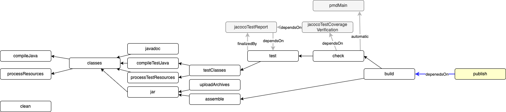
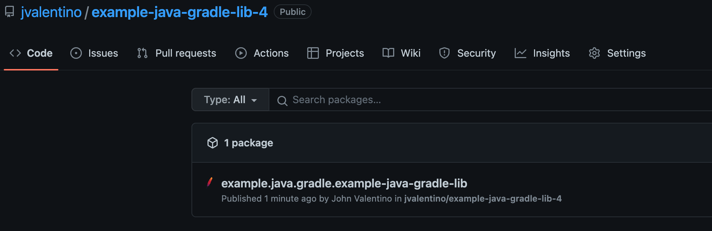
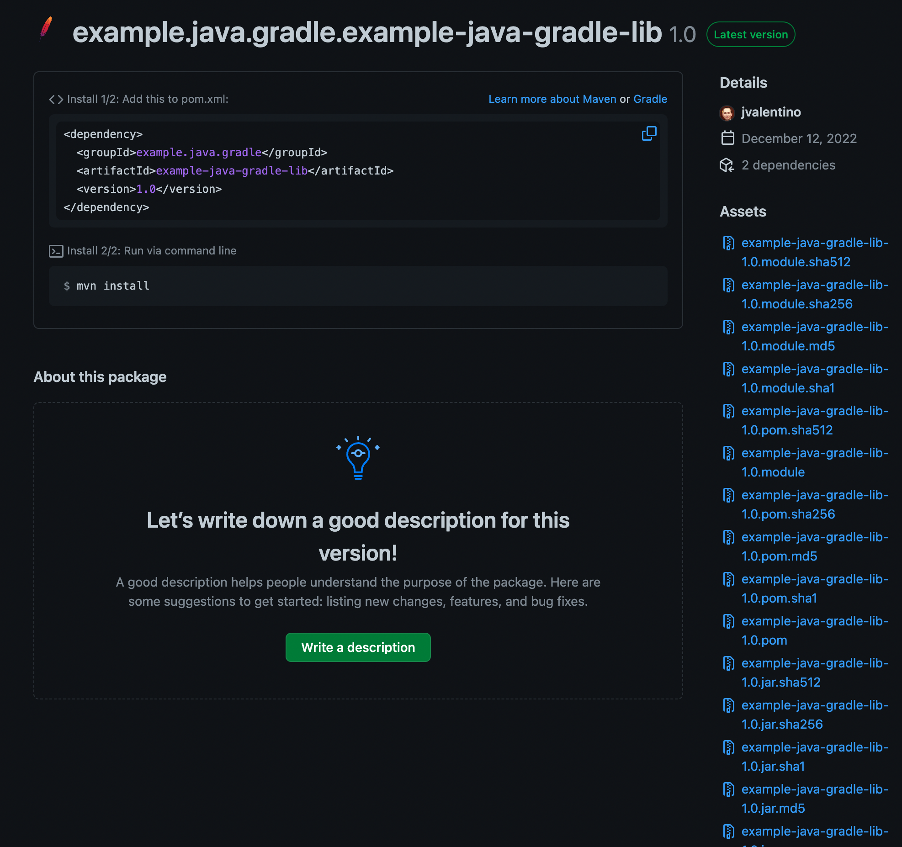

# Example Java Library using Gradle: Part 4

This is the final step in the Java Library example, which demonstrates how to publish the Jar file to a Maven style repository hosted on Github.com as a package.

Prerequisites

- Git Setup: https://github.com/jvalentino/setup-git
- Building Java 101: https://github.com/jvalentino/java-building-101
- Gradle-Java Part 1: https://github.com/jvalentino/example-java-gradle-lib-1
- Gradle-Java Part 2: https://github.com/jvalentino/example-java-gradle-lib-2
- Gradle-Java Part 3: https://github.com/jvalentino/example-java-gradle-lib-3

# (1) What is a Maven Repository?

> A repository in Maven holds build artifacts and dependencies of varying types.
>
> There are exactly two types of repositories: **local** and **remote**:
>
> 1. the **local** repository is a directory on the computer where Maven runs. It caches remote downloads and contains temporary build artifacts that you have not yet released.
> 2. **remote** repositories refer to any other type of repository, accessed by a variety of protocols such as `file://` and `https://`. These repositories might be a truly remote repository set up by a third party to provide their artifacts for downloading (for example, [repo.maven.apache.org](https://repo.maven.apache.org/maven2/)). Other "remote" repositories may be internal repositories set up on a file or HTTP server within your company, used to share private artifacts between development teams and for releases.

- https://maven.apache.org/guides/introduction/introduction-to-repositories.html

# (2) Why Github.com Packages?

...because it is there, it is free, and I don't need someone to manually approve a project like on Maven Central.

The theory here works anywhere. You just need to add the appropriate repository type, credentials, and URL.

# (3) The Maven Publish Plugin

## build.gradle

```groovy
plugins {
    // ...
    // MAVEN!
    id 'maven-publish'
}

// ...

// MAVEN !
publish {
    dependsOn build
}

publishing {
    repositories {
        maven {
            name = "GitHubPackages"
            url = uri("https://maven.pkg.github.com/jvalentino/example-java-gradle-lib-4")
            credentials {
                username = project.getProperties().get("MVN_USERNAME")
                password = project.getProperties().get("MVN_PASSWORD")
            }
        }
    }
    publications {
        gpr(MavenPublication) {
            groupId = 'example.java.gradle'
            artifactId = 'example-java-gradle-lib'
            version = project.getProperties().get("MVN_VERSION")

            from components.java
        }
    }
}

```

Topics

- repositories.maven
- credential theory
- project.getProperties() and -P
- group, artifactId, and version

## How will this work?



## Running it

Remember how we made username, password, and version parameters?

```bash
./gradlew -i --stacktrace publish \
    -PMVN_USERNAME=your_username \
    -PMVN_PASSWORD=your_api_token \
    -PMVN_VERSION=1.0
```





# FAQ

## SunCertPathBuilderException: unable to find valid certification path to requested target

This will be encountered if your company is swapping the root level certificates in use with your web browser, with its own. This is common when dealing with coporate environments.

Export the certificate for .pkg.githib.com

Chrome -> https://maven.pkg.github.com/ -> Lock Icon -> Connection is Secure -> Details -> whatever you company root certificate it -> Export -> Save As .cer file as _.pkg.github.com.pem 

Rename the .cer to .pem

Import it into your Java keystore.

```bash
keytool -import -trustcacerts -alias gitmaven \
	-file _.pkg.github.com.pem \
	-keystore /opt/homebrew/Cellar/openjdk/19.0.1/libexec/openjdk.jdk/Contents/Home/lib/security/cacerts \
	-storepass changeit
```

Create a gradle.properties file that specifies to use this trust store:

```properties
org.gradle.jvmargs=-Djavax.net.ssl.keyStore="/opt/homebrew/Cellar/openjdk/19.0.1/libexec/openjdk.jdk/Contents/Home/lib/security/cacerts" -Djavax.net.ssl.keyStoreType=KeychainStore -Djavax.net.ssl.keyStorePassword=changeit

```

Reference: https://emcorrales.com/blog/how-to-use-a-self-signed-certificate-with-gradle


